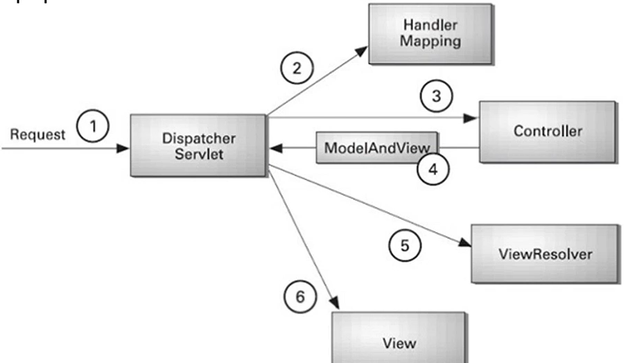
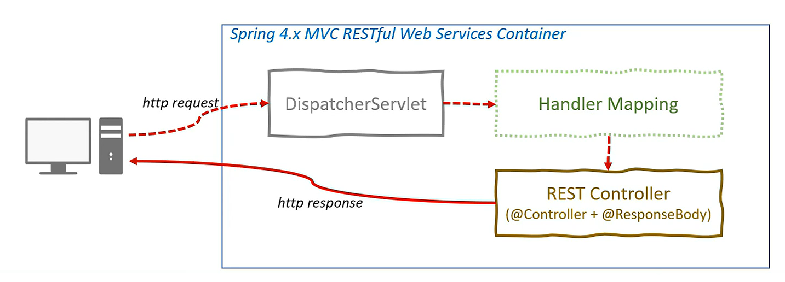

```
@date   : 2022-04-03 19:08
@author : ymkim
@desc   : DispatcherServlet 프로젝트 동작의 이해 & Path Variable 사용
```

## Spring Boot 동작 원리

아래 파일 포맷 형식을 사용하면 보다 직관적으로 설정이 가능하다.

- application.properties
- application.yml

```yaml
logging:
  level:
    org.springframework: DEBUG
```

- Logging 관련 설정 추가.

## DispatcherServlet

```log
DispatcherServletAutoConfiguration matched:
      - @ConditionalOnClass found required class 'org.springframework.web.servlet.DispatcherServlet' (OnClassCondition)
      - found 'session' scope (OnWebApplicationCondition)

   DispatcherServletAutoConfiguration.DispatcherServletConfiguration matched:
      - @ConditionalOnClass found required class 'javax.servlet.ServletRegistration' (OnClassCondition)
      - Default DispatcherServlet did not find dispatcher servlet beans (DispatcherServletAutoConfiguration.DefaultDispatcherServletCondition)

   DispatcherServletAutoConfiguration.DispatcherServletRegistrationConfiguration matched:
      - @ConditionalOnClass found required class 'javax.servlet.ServletRegistration' (OnClassCondition)
      - DispatcherServlet Registration did not find servlet registration bean (DispatcherServletAutoConfiguration.DispatcherServletRegistrationCondition)

   DispatcherServletAutoConfiguration.DispatcherServletRegistrationConfiguration#dispatcherServletRegistration matched:
      - @ConditionalOnBean (names: dispatcherServlet types: org.springframework.web.servlet.DispatcherServlet; SearchStrategy: all) found bean 'dispatcherServlet' (OnBeanCondition)
```

DispatcherServlet은 사용자의 요청을 처리하는 일종의 Gateway로써, 해당 로그를 보면  
DispatcherServletAutoConfiguration.DispatcherServletRegistrationCondition이 실행된 것을 확인할 수 있다. 



 > Dispatcher의 사전적 의미는 어떠한 정보를 보내다, 파견하다, 발송하다 로 정의가 되어 있다.

DispatcherServlet란 서블릿 컨테이너에서 HTTP Protocol을 통해 들어오는 모든 요청 값을 처리하기 위해서 Presentation 계층에 제일  
앞딴에 위치하여 중앙집중식의 요청/처리를 하기 위한 Front Controller로써 사용이 되는 일종의 Gatewat다. 쉽게 말해 사용자의 요청의  
시작과 끝은 DispatcherServlet에서 시작하여 DispatcherServlet에서 끝난다.

### MVC Pattern with DispatcherServlet

1. 클라이언트의 요청을 DispatcherServlet이 받는다.
2. DispatcherServlet은 해당 요청을 HandlerMapping에게 전달하여, 요청에 맞는 Controller를 정한다.
3. Controller는 흐름 제어를 통해 비즈니스 로직을 처리하고 ModelAndView 객체에 데이터를 담아 전달한다.
4. DispatcherServlet은 해당 ModelAndView 객체를 다시 한번 ViewResolver에게 전달한다.
5. 마지막으로 해당 결과(Reseponse)를 View에 반환 한다.

## RestController



> 반환값이 JSON인 경우 사용이 되는 @RestController

- Spring4부터 @RestController 어노테이션을 지원한다.
- @Controller + @ResponseBody
- View를 갖지 않는 REST Data(`JSON/XML`)을 반환 한다.
    - JSP / thymeleaf 와 같은 템플릿 엔진 사용 안한다는 의미.
    
## Path Variable

### URI endpoint 예제

```http request
http://localhost:8080/books/
http://localhost:8080/books/1
http://localhost:8080/books/123
```

### Java 내에서의 사용 방식

```java
// hello-world-bean/path-variable/kenneth
// 다른 값을 파라미터명으로 받는 경우 => @PathVariable(value = "파라미터명")
public class HelloWorldBean {
    @GetMapping(path = "/hello-world-bean/path-variable/kenneth")
    public HelloWorldBean(@PathVariable String name) {
        return new HelloWorldBean(String.format("Hello World, %s", name));
    }    
}
```

### Reponse 값

```json
{
  "message" : "Hello World Bean, kenneth"
}
```

- 가변 변수를 URI에 사용하는 경우 @PathVariable을 사용한다.
- 기존 Spring MVC에서부터 사용이 되던 기술이다.

## User Service API 추가

- User Domain 생성
- GET
- POST
- Exception Handling
- DELETE